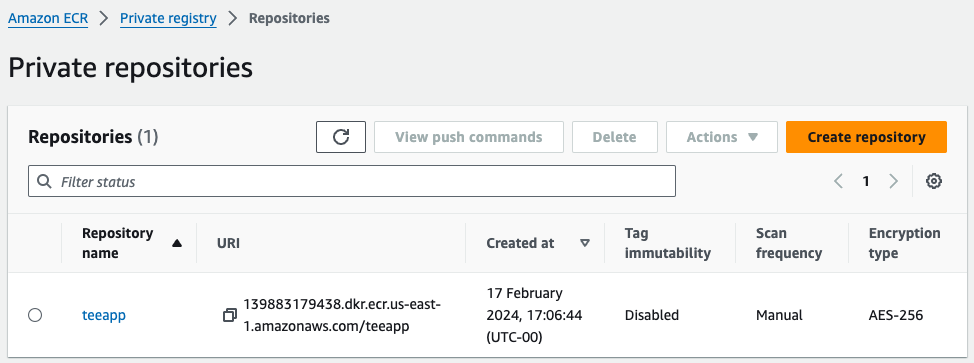
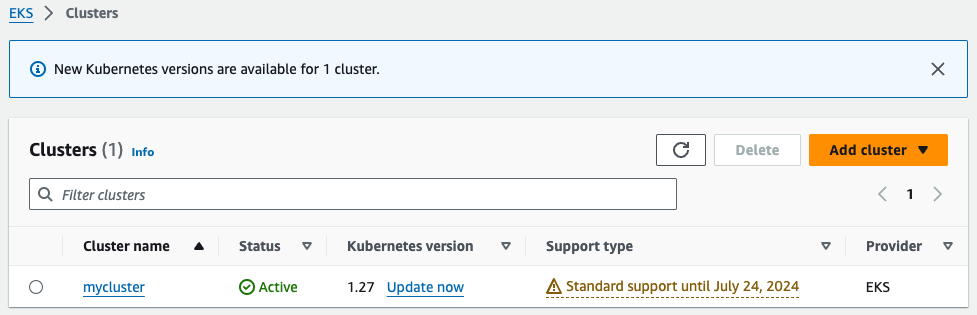
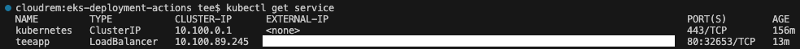
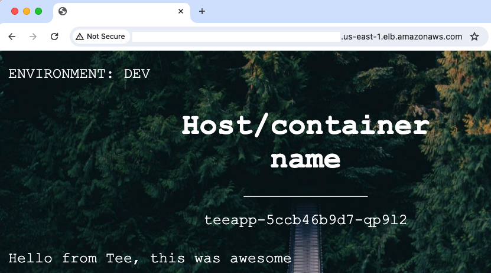

# Deploying Node.js Application to Amazon EKS with GitHub Actions

This guide demonstrates how to deploy a Node.js application to Amazon Elastic Kubernetes Service (EKS) using GitHub Actions.

## Prerequisites

Ensure you have the following prerequisites installed and configured:
- Docker
- GitHub Actions
- ECR (Elastic Container Registry)
- EKS (Elastic Kubernetes Service)
- Kubernetes
- AWS CLI with configured credentials

## Steps

### 1. Create an ECR repository



### 2. Set up GitHub Actions Workflow

Create a [YAML file](https://github.com/teeseira/eks-deployment-actions/blob/main/.github/workflows/github-actions-ci.yml) for your workflow.

### 3. Create an EKS Cluster



### 4. Push Files to GitHub

If you haven't already, create a GitHub repository - naming it the same name as your local working directory.

Then, push your local files to the remote GitHub repository.

### 5. Set Up Secrets
In your GitHub repository settings, add the necessary secrets for accessing AWS services securely.

### 6. Trigger GitHub Actions Workflow
The workflow will build, tag, and push the Docker image to Amazon ECR. It will then create a deployment using deployment.yaml and a service using service.yaml.

### 7. Test Application

Retrieve the DNS name of your service:

```
kubectl get service
```

<br><br>
